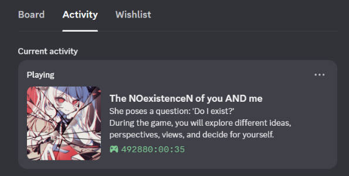

# Prerequisites

You will need Python and a code editor installed to run this application. 

# Setup
Step 1: Create an app at https://discord.com/developers/applications

Step 2: Place your desired image in your app, named "lilith" (Rich presence -> Art assets)

Step 3: Clone repo to IDE of your choice

Step 4: Copy your APP ID (from the app you made earlier), and set it in your .env (APP_ID = "Your ID here")

Step 5: Create a venv in your IDE terminal and activate it.

Step 6: Install dependencies from requirements.txt

Step 7: Run
